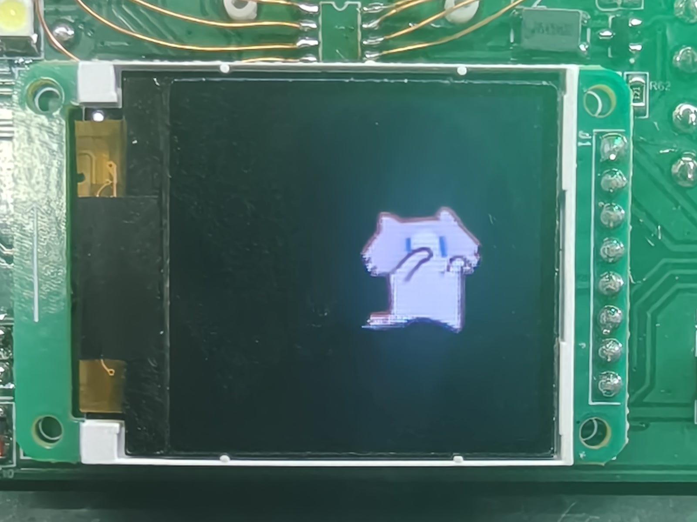
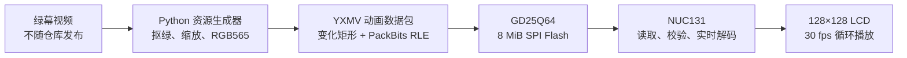

<h1 align="center">yuexinmiao</h1>

<p align="center">
  基于 NUC131 与 GD25Q64 的 128×128 RGB565 裸机动画播放器
</p>

<p align="center">
  <a href="README_EN.md">English</a> ·
  <a href="docs/HARDWARE.zh-CN.md">硬件说明</a> ·
  <a href="docs/FLASHING.zh-CN.md">烧录指南</a> ·
  <a href="docs/RESOURCE_FORMAT.zh-CN.md">资源格式</a>
</p>

<p align="center">
  
  
  
  
  
  <a href="LICENSE"></a>
</p>

`yuexinmiao` 是一个经过实物验证的 MCU 裸机动画播放项目。NUC131SD2AE 从
GD25Q64 SPI NOR Flash 连续读取 YXMV 差分压缩资源，实时解码 RGB565 帧，并通过
GPIO 模拟串行接口驱动 128×128 LCD，以固定 30 fps 循环播放。

项目同时提供完整 Keil 工程、可直接烧录的 MCU/Flash 固件、资源生成工具、离线校验
工具和资源格式文档。原始猫咪 MP4 与预览视频不在本仓库中。

## 实物验证

[](docs/media/hardware-validation.mp4)

上图为目标板实际运行效果。点击图片或
[播放 10.8 秒实拍视频](docs/media/hardware-validation.mp4)，可查看猫咪动画在 128×128
LCD 上连续播放的效果。公开版本已转换为兼容浏览器的 H.264 MP4，并移除录音轨和
拍摄元数据；它是硬件验证记录，不是用于生成 Flash 固件的猫咪原素材。

## 项目亮点

- **实物验证**：NUC131、GD25Q64 与 LCD 的完整播放链路已经在目标板验证通过。
- **速度不变**：固定保留 1210 帧和 30 fps，不依靠丢帧改变动画节奏。
- **面向小型 MCU**：使用逐帧变化矩形与 PackBits RLE，MCU 无需保存完整视频帧集。
- **启动自检**：校验 Flash JEDEC ID、资源头、数据边界和 CRC32。
- **错误可见**：用不同纯色画面区分 Flash、资源、解码和刷新积压故障。
- **交付完整**：仓库内同时包含源码、Keil 工程、发布固件、校验报告和 Python 工具。

## 实测配置

| 项目 | 结果 |
| --- | --- |
| MCU | Nuvoton NUC131SD2AE，Arm Cortex-M0，48 MHz |
| 外部 Flash | GD25Q64，8 MiB，SPI0 Mode 0，10 MHz |
| LCD | 128×128，RGB565，GPIO 模拟串行写屏 |
| 动画 | 1210 帧，30 fps，约 40.33 秒循环 |
| 资源格式 | YXMV v1，变化矩形 + PackBits RLE |
| 动画数据包 | 2,289,920 字节 |
| GD25Q64 镜像 | 8,388,608 字节，使用率 27.298% |
| MCU 构建 | Code=5056，RO-data=304，RW-data=60，ZI-data=1028 |
| Keil 结果 | 0 Error(s)，0 Warning(s) |

完整离线解码结果见
[`release/GD25Q64/validation_report.json`](release/GD25Q64/validation_report.json)。

## 工作原理



TIMER0 只负责产生 30 Hz 帧事件，Flash 读取、RLE 解码和 LCD 刷新均在主循环完成。
如果事件连续积压，固件进入青屏错误，而不是静默丢帧导致动画加速或减速。

## 快速开始

不修改动画内容时，只需分别烧录两个配套文件。

### 1. 烧录 GD25Q64

将完整镜像从外部 Flash 地址 `0x000000` 写入，执行整片擦除、写入和读回校验：

```text
release/GD25Q64/release_yuexinmiao_gd25q64_8MiB.bin
```

| 参数 | 数值 |
| --- | --- |
| 起始地址 | `0x000000` |
| 写入长度 | 8,388,608 字节 |
| SHA-256 | `16D314AFA7C8ABD02B2C1785508F3B3C23EEA64178A7AE9C3B0323A44E12105A` |

### 2. 烧录 NUC131

将下面的 HEX 文件写入 NUC131SD2AE APROM：

```text
release/MCU/release_yuexinmiao.hex
```

| 参数 | 数值 |
| --- | --- |
| 目标区域 | APROM |
| SHA-256 | `DA5D2E0665D18C07A70C146DF9B20E2C8D0562842AA9D5E01327378DA5DA263B` |

> [!IMPORTANT]
> MCU 固件和 GD25Q64 镜像必须配套使用。不要把 8 MiB Flash BIN 写入 MCU，也不要
> 把 MCU HEX 写入外部 Flash。

详细步骤见[烧录指南](docs/FLASHING.zh-CN.md)。

## 上电状态

| 屏幕状态 | 含义 |
| --- | --- |
| 正常动画 | Flash、资源、解码和显示链路正常 |
| 红屏 | Flash 通信失败或 JEDEC ID 不匹配 |
| 洋红屏 | 资源头、尺寸、帧率或索引 CRC 错误 |
| 黄屏 | 播放过程中发生 Flash、解码或 LCD 写入错误 |
| 青屏 | 帧事件连续积压，系统无法维持 30 fps |

## 从源码构建 MCU 固件

推荐环境：

- Keil MDK 5
- ARM Compiler 5.06 update 6
- Nuvoton Nu-Link（仅烧录 MCU 时需要）

打开工程：

```text
firmware/KEIL/yuexinmiao.uvprojx
```

工程使用仓库内的最小 Nuvoton BSP 子集，不依赖原开发电脑的绝对路径。本机 Nu-Link
探针配置和序列信息已排除。已验证的完整构建日志位于
[`release/MCU/build_log.txt`](release/MCU/build_log.txt)。

## 生成自己的动画资源

依赖 Python 3.9+、`ffmpeg` 和 `ffprobe`。将自己拥有合法使用权的绿幕 MP4 放入
已被 Git 忽略的 `assets/input/`，然后执行：

```powershell
python tools/generate_animation_pack.py `
  --input assets/input/your_animation.mp4 `
  --output-dir build/resources
```

生成器完成绿幕抠除、等比例缩放、RGB565 转换、差分矩形提取和 PackBits RLE 编码。
当前工具锁定 30 fps 与 1210 帧，用于防止误改已经上板验证的动画速度。

生成完成后运行离线校验：

```powershell
python tools/validate_animation_pack.py `
  --pack build/resources/release_yuexinmiao_animation_pack.bin `
  --image build/resources/release_yuexinmiao_gd25q64_8MiB.bin `
  --report build/resources/validation_report.json
```

若资源头文件发生变化，还需要同步更新
`firmware/Resources/generated/animation_resource.h` 并重新编译 MCU 固件。资源二进制
布局和 CRC 规则见[资源格式说明](docs/RESOURCE_FORMAT.zh-CN.md)。

## 仓库结构

```text
.
├── firmware/
│   ├── App/                 播放调度、故障处理和应用入口
│   ├── Drivers/             GD25Q64 与 LCD 驱动
│   ├── KEIL/                可直接打开的 Keil 工程
│   └── Resources/           固件使用的资源格式常量
├── tools/                   动画资源生成器和完整镜像校验器
├── release/
│   ├── MCU/                 NUC131 HEX、BIN 与构建日志
│   └── GD25Q64/             资源包、8 MiB 镜像、manifest 与校验报告
├── vendor/                  构建所需的最小 Nuvoton BSP/CMSIS 子集
├── docs/
│   ├── media/               目标板实拍照片和 H.264 验证视频
│   └── *.md                 硬件、烧录、资源格式和发布说明
└── assets/                  本地素材放置说明，不包含原始视频
```

## 文档

- [硬件连接与已验证参数](docs/HARDWARE.zh-CN.md)
- [MCU 和 GD25Q64 烧录指南](docs/FLASHING.zh-CN.md)
- [YXMV 资源格式与校验规则](docs/RESOURCE_FORMAT.zh-CN.md)
- [GitHub 发布流程](docs/PUBLISHING.zh-CN.md)
- [开源包检查记录](PACKAGE_CHECKS.md)
- [版本发布说明](RELEASE_NOTES_v1.0.0.md)

## 贡献

欢迎提交问题、改进文档或适配其他屏幕和 SPI NOR Flash。修改引脚、LCD 初始化序列、
帧率、资源格式或 Flash 分区前，请说明目标硬件并附上可复现的验证结果。贡献流程见
[`CONTRIBUTING.md`](CONTRIBUTING.md)。

## 许可证与素材边界

项目原创源代码使用 [MIT License](LICENSE)。Nuvoton BSP 与 Arm CMSIS 保留各自的
许可证和版权声明。

原始猫咪 MP4、灰色预览视频和开发过程素材没有进入仓库。`release/GD25Q64/` 中的
资源固件属于素材转换结果，不自动适用 MIT License；再次分发前应确认相应素材权利。
详见[第三方及资源声明](THIRD_PARTY_NOTICES.md)。

## 致谢

- [Nuvoton](https://www.nuvoton.com/) 提供 NUC131 BSP 与芯片支持。
- [Arm CMSIS](https://www.arm.com/technologies/cmsis) 提供 Cortex-M 软件接口基础。
- [Ultralytics YOLOv5](https://github.com/ultralytics/yolov5) README 为本项目首页的信息架构提供了参考。
